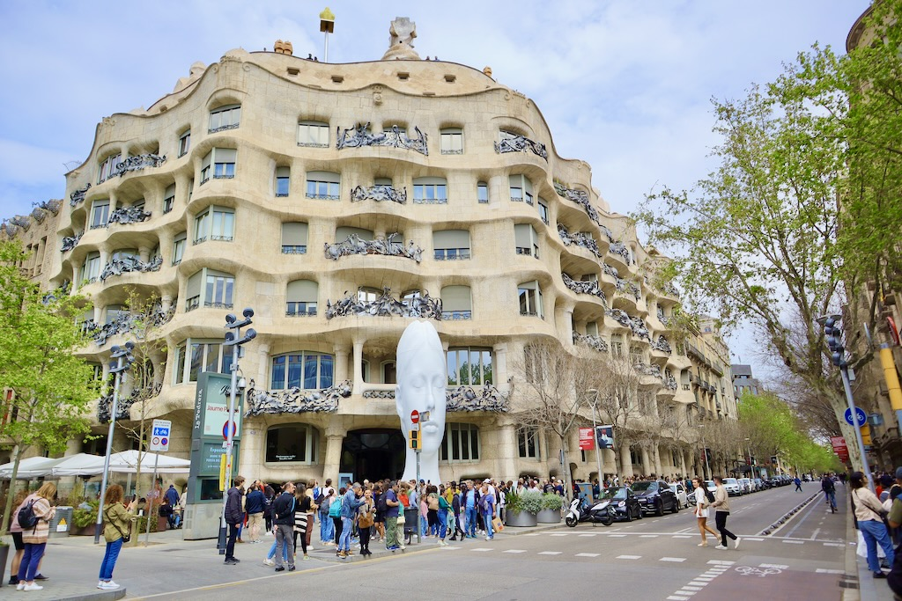
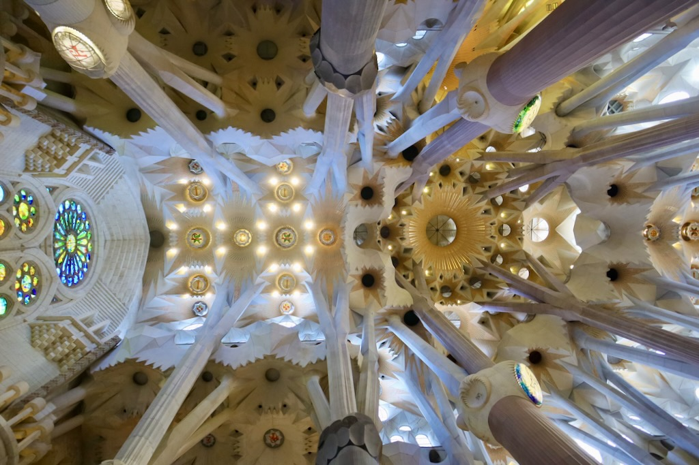
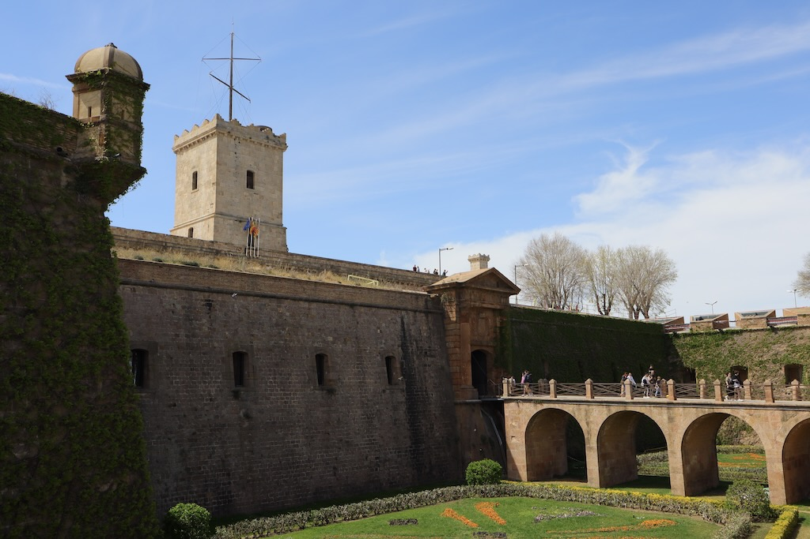

A few weeks ago we visited Barcelona. I've been there some 17 years ago but I forgot most of it.

We had a plan that, high level, resembled this:
- First day: El Gothic, La Rambla, Barceloneta
- Second day: Montjuic
- Third day: passeig de gracia and Tibidabo
- Fourth day: Hospital Sant Pau, Sagrada Família, Arc de Triuph and Parc de la Ciutadella
- Fifth day: Park Guel

We stayed at a hotel in La Rambla, near the Liceu subway station. As it's a very turistic area, the prices aren't the most friendly but it allows you to move around a lot by foot. La Rambla, El Gothic, Passeig de Gracia, even Carrer de Blai are all accessible by foot.

We did buy a regular travel card with 10 trips and used 9. We looked into the Hola Card but it's much more expensive and didn't foresee the need for more trips so the regular card worked great. We did go for the AeroBus instead of the subway which took longer and required a line change, which is annoying with suitcases.

## El Gothic

El gothic is the old town. Just dive in and explore its streets.








### Cathedral 

:(fa-brands wikipedia-w):
:(fa-solid fa-wifi):

The Cathedral was under maintenance and had a huge ad covering the area under work which was a bit annoying. We did go to the roof to enjoy a view of the city.









### Sant Felip Neri
A square with a church of the same name where still remain the marks of [a bombing](https://en.wikipedia.org/wiki/Pla%C3%A7a_de_Sant_Felip_Neri "Wikipedia") in 1938 that killed 30 people, mostly children.

### Plaça de Sant Jaume
[Plaça Sant Jaume](https://en.wikipedia.org/wiki/Pla%C3%A7a_Sant_Jaume "Wikipedia") is the square where the government of Catalunya and the City Hall are located.

### Plaça del Rei
[Plaça del Rei](https://en.wikipedia.org/wiki/Pla%C3%A7a_del_Rei "Plaça_del_Rei")

### Plaça Reial
[Plaça Reial](https://en.wikipedia.org/wiki/Pla%C3%A7a_Reial "Plaça_Reial")

### Les Galeries Maldà

## La Rambla

### La Boqueria

### Palau Guel

## La Barceloneta

## Passeig de Gràcia

### Casa Batlò

### La Pedrera (Casa Milà)

## Avinguda Gaudí
### Sant Pau Recinte Modernista

### Temple Expiatori de la Sagrada Família

## Passeig de Lluís Companys

### Arc de Triomf

### Parc de la Ciutadella

## Park Guel

## Montjuïc Mountain

### Plaça d'Espanya / Torres Venecianes

### Magic Fountain of Montjuïc

### CaixaForum

### Palacio Nacional

### Fundació Joan Miró

### Telefèric de Montjuïc

### Castell de Montjuïc

### Olympic Stadium Lluís Companys

## Muntanya de Tibidabo

# Food

## La Rambla / El Gothic

### Tabarlot

### Conesa Entrepans

### El Bosc de les Fades

### Tapas Bravas

## Calle Blai

### Blai 9

### La Tasqueta de Blai

## Passeig de Gràcia

### Cerveseria Catalana

## Avinguda Gaudí
### El Piso

